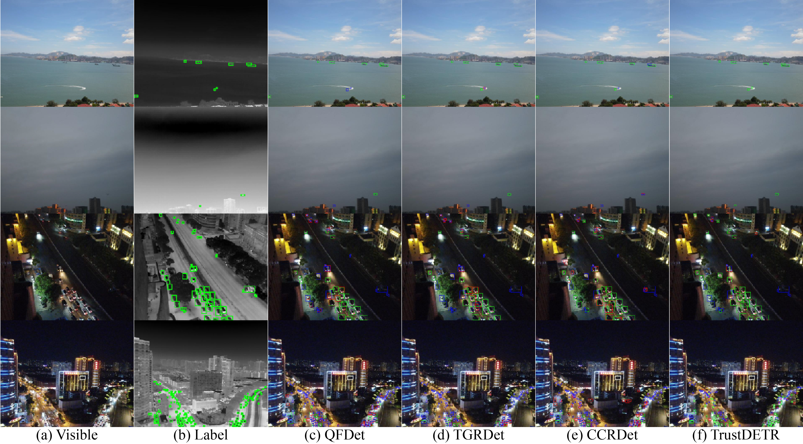
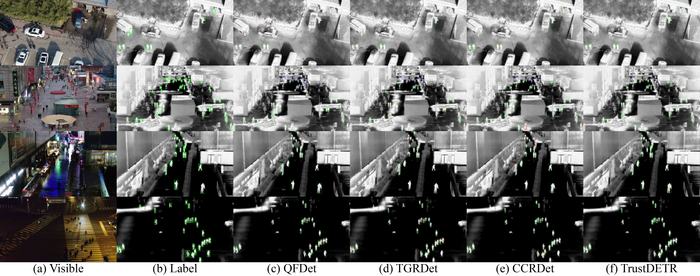

# TrustDETR Demo

This is the demo page for **TrustDETR**, an RGB-T object detector for aligned visible–infrared image pairs.

Detection results on three benchmarks:

### RGBTDronePerson



### VTUAV



### RGBT-Tiny


**The full release — including training code and pretrained models — will be made public immediately after the paper is officially accepted.**

## Run locally

```bash
pip install -r requirements.txt
python app.py
```

Open `http://localhost:7860` to view the result gallery.

## Citation

```bibtex
@article{trustdetr2026,
  title   = {TrustDETR},
  author  = {},
  journal = {},
  year    = {2026},
  note    = {Under review}
}
```
